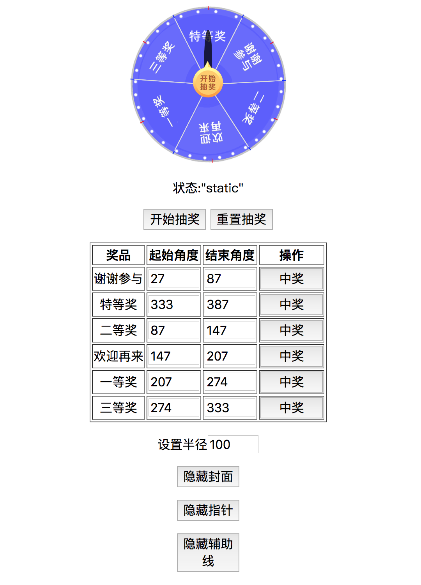

# LuckyRoulette
Lucky Roulette 
幸运转盘
## 
```
<Roulette></Roulette>
```
### Attributes
- datas

  分块数据（type: Array,default:[{name: 'p1',degs: [30, 90]}, {name: 'p2',degs: [90, 150]}, {name: 'p3',degs: [150, 210]}, {name: 'p4',degs: [210, 270]}, {name: 'p5',degs: [270, 330]}, {name: 'p6',degs: [330, 390]}]）
  
  name为块名，需唯一；degs为块的起始和结束角度，正数，范围不可重合，可不连续
  
- r

  半径（type: Number,default: 100）

- ease

  缓动距离（type: Number,default: 5）：状态从brake到stop时的转动圈数。
  
- speed

  转速（type: Number,default: 1）：转动1圈所需秒数。
  
- coverurl

  封面图片地址（type: String）
  
- pointerurl

  指针图片地址（type: String）
  
- test

  是否显示辅助线（type: Boolean,default: false）：帮助调整区块的度数范围和UI相符。
  
- vague

  避免视觉误差，在视觉上指针远离选中区域两侧边线的角度（type: Number,default: 10）
  
- disabled

  不可用性（type: Boolean,default: false）
  
### Events
- during

  转动时的回调（type: Function,default: new Function()）
  
  返回状态：static（静止状态：默认，指针向上，旋转归零）->play（运行）->trans（过渡）->brake（减速）->stop（停止）
  
### Methods
- play
  
  运行，状态从(static->play或stop->static->play)

- brake(name)
  
  减速至name点，状态从(play->trans->brake->stop)

- reset

  重置，让转盘回到初始状态。一般的连续抽奖只需play->brake->play->brake无需reset
  

